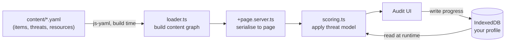

# Spectra

**Personal Security Self-Audit Framework** — by [FPS Zero](https://fpszero.com)

Spectra builds a security checklist weighted to your actual threat model, rather than a generic
best-practices list. A journalist, a parent, and a domestic-abuse survivor face different adversaries,
so the same control gets a different priority for each. The scoring engine applies per-adversary
multipliers to produce that ordering.

Everything runs in the browser. No server, no accounts, no analytics. Your assessment state is stored
in IndexedDB on your device and never leaves it.

**Live:** [spectra.fpszero.com](https://spectra.fpszero.com/)

## How it works

Content is authored as YAML and compiled into a graph at build time. The scoring engine combines that
static graph with your local profile (held in IndexedDB) to produce a personalised priority order.
There is no backend.



## Features

- **Threat-model-driven scoring.** You select your adversaries, platforms, and tracks. The engine
  applies per-adversary multipliers to every item, so the priority order reflects your risk.
- **Human-vulnerability audit.** A 7-question social-engineering quiz scores your exposure to each
  influence technique (authority, urgency, scarcity, trust exploitation, and others) and weights the
  human-vulnerability items accordingly.
- **Knowledge graph.** Checklist items, abstract controls, threat nodes, and curated resources are
  cross-referenced. The threat graph shows which adversaries reach which assets through which controls.
- **Landscape multipliers.** A small, curated set of active real-world events temporarily raises the
  priority of affected items. Hand-curated and source-backed — not a live feed.
- **Local timeline.** Completed items, score milestones, and applied life events are logged in your
  browser so you can see change over time.

## Scoring

Each item has a base `score_weight` (0–10). The engine computes, per item:

```
effective_score = base_weight
                × threat_multiplier        (max across your selected adversaries)
                × landscape_multiplier      (active real-world events)
                × (1 − compensating_factor) (a stronger control you already have)
                × staleness_multiplier      (how recently the guidance was verified)
```

Per-category score is earned ÷ available effective_score; the overall score is the mean across
categories. Spectra is a **prioritisation engine**, not a calibrated risk calculator — the weights are
principled expert judgement anchored to public data (DBIR, IC3, HIBP), documented in
[SCORING.md](SCORING.md) and on the on-site [methodology page](https://spectra.fpszero.com/methodology).

## Getting started

Requires Node.js 20+ and npm 10+.

```bash
git clone https://github.com/KashishOO7/spectra.git
cd spectra
npm install

npm run validate   # schema + cross-reference checks
npm run dev         # local dev server
npm run build       # static production build
```

## Project layout

SvelteKit frontend with a static content engine. Content is YAML, loaded at build time and baked into
the static output via `adapter-static`; deployed to GitHub Pages.

```
spectra/
├── content/                # CC BY-SA 4.0
│   ├── items/              # checklist items (one YAML per item)
│   ├── controls/           # abstract security mechanisms (MFA, FDE)
│   ├── threats/            # adversary × attack-vector threat nodes
│   ├── resources/          # curated tools with privacy-posture ratings
│   └── landscape-feed.yaml # active real-world events with scoring multipliers
├── scripts/                # validate, maintain (content health), new:item, check:links
├── src/
│   ├── lib/
│   │   ├── content/        # YAML parser and graph builder
│   │   ├── engine/         # scoring engine and IndexedDB store
│   │   └── types.ts        # canonical TypeScript types
│   └── routes/             # audit, graph, resources, threats, timeline,
│                           # methodology, references, about
├── .github/workflows/      # ci.yml deploys; content/landscape automation
│                           # is dormant (manual dispatch only)
├── static/                 # PWA manifest, service worker, CNAME
├── SCORING.md  CONTRIBUTING.md  LICENSE
```

## Contributing

See [CONTRIBUTING.md](CONTRIBUTING.md). All `/content` changes must pass `npm run validate`, and factual
claims need a primary source in the YAML. `score_weight`, threat multipliers, and the women's-safety
and children's tracks are protected — changes require maintainer review (see `CODEOWNERS`).

## License

Code (`/src`, `/scripts`): AGPL-3.0. Content (`/content`): CC BY-SA 4.0.
