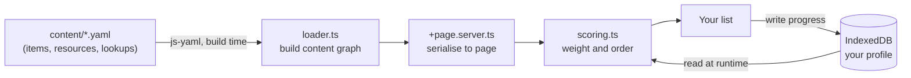

# Spectra

**Personal security self-audit** by [FPS Zero](https://fpszero.com)

Most security advice is a generic hundred-item wall, which is why most people bounce off it.
Spectra asks what you are worried might happen, then returns a short ordered list of what to do
about it. A journalist, a parent and a domestic-abuse survivor get different priorities out of the
same corpus, because the weighting follows the situation the reader describes.

Everything runs in the browser. No server, no accounts, no analytics. Your state lives in IndexedDB
on your own device and never leaves it.

**Live:** [spectra.fpszero.com](https://spectra.fpszero.com/)

---

## The model

Four layers, and only the bottom two ever move. That is the whole design: new technology arrives as
a new *method* plus some new steps, slotted under a harm that already exists, so nothing at the top
has to be rewritten.

```
WHO YOU ARE          you pick, or skip            rarely changes
WHAT CAN HAPPEN      8 harms                      never changes
HOW IT HAPPENS       16 attack vectors today      changes with technology
WHAT YOU DO          32 steps today               grows forever
```

The eight harms are plain sentences, and they are the front page:

> Someone gets into your accounts · takes your money · talks you into it · follows where you go ·
> reads what you say · uses your device against you · pretends to be you · already has your details

Harm membership is **derived**, from the `assets_protected` and `attack_vectors` that every item
already carries. There is no harm field in the YAML and no manual tagging to keep in step. An item
belongs to every harm whose assets or vectors it covers, so items land in about three of them on
purpose: several doors into the same content. A blocking validator rule fails the build if any item
resolves to no harm at all.

---

## How it works

Content is authored as YAML and compiled into a graph at build time. The engine combines that
static graph with your local profile to produce the ordering. There is no backend.



Tap harms on the front page and that is the whole profile: the tap writes it directly, with no
signup screen and no settings to discover. A four-step questionnaire refines it for anyone who
wants more precision, adding who might try, which platforms you use and which tracks apply, and
everything works for someone who taps nothing at all.

---

## What it does

- **Weighted ordering.** Every step carries a base weight and a threat multiplier (the highest
  across your chosen adversaries, never compounded), so the same control sits in a different place
  for different readers. The ordering number is internal and is never shown to anyone as a number.
- **Your list.** The ordered steps, each with a plain one-sentence description, per-platform
  instructions, and a primary source.
- **Your map.** A graph of the harms you tapped, the actors those harms imply, and the steps that
  help. Clicking an actor states which of your own taps put it there rather than simply appearing.
- **A social-engineering questionnaire.** Seven questions across the Cialdini registers
  (authority, urgency, trust, fear, scarcity, reciprocity, social proof). The result reweights the
  `human_vulnerability` steps between 0.8 and 1.4. The susceptibility score itself stays internal.
- **Guides, not a catalogue.** `/resources` points at the eight maintained guides our steps
  reference, above links to Privacy Guides and EFF Surveillance Self-Defense. Spectra does not keep
  a tool catalogue, does not name apps to go and get, and does not rate anyone.
- **Something happened.** An incident path for the reader who is already in trouble, with the
  order-of-operations that matters when a device may be watched.
- **Local timeline.** Completed steps, milestones and applied life events, recorded in your browser
  so you can see change over time.

---

## Scoring

One number used to answer two questions, which is where every scoring defect came from. It is split
into three, and they never mix again. Full contract in [SCORING.md](SCORING.md), and on the on-site
[methodology page](https://spectra.fpszero.com/methodology).

**Priority** decides what to offer next. Internal, never rendered as a number, a badge or a rank:

```
priority = base_weight                    (0 to 10, expert judgement, CODEOWNERS-protected)
         × threat_multiplier              (max across your actors, never compounded)
         × (1 − compensating_factor)      (a stronger control you already have)
```

**Coverage** is the only number a reader sees, `earned weight ÷ total applicable weight`. Skipped
steps stay in the denominator, because declining is not progress. The headline above it is a count
of harms rather than a percentage, `N of 8 covered`.

**Freshness** is a count and a list, never a deduction. An item is worth re-reading when its
guidance actually changed, which is a `version` bump, not when a file was last touched. Nothing in
the UI derives anything from a date.

Two things that used to be in the formula are gone from the engine, not merely hidden: a curated
events feed, which double-counted facts already priced into `base_weight`, and a staleness discount,
which made a finished score fall on a date for a reason nobody could act on.

Spectra is a **prioritisation engine**, not a calibrated risk calculator. The weights are principled
expert judgement anchored to public data (DBIR, IC3, HIBP), and
[SCORING.md](SCORING.md) says so plainly rather than implying more.

---

## Getting started

Requires Node.js 20+ and npm 10+.

```bash
git clone https://github.com/KashishOO7/spectra.git
cd spectra
npm install

npm run dev         # local dev server
npm run validate    # content, taxonomy and no-internals-on-screen gates. Blocking, runs in CI
npm run check       # svelte-check over src/ and tests/
npm run build       # static production build
```

Tests are Playwright, in two projects. The engine project is pure and gates CI; the browser project
needs `npm run dev` running and does not gate:

```bash
npx playwright test --project=engine
npx playwright test --project=browser
```

Content maintenance, run locally rather than on a cron:

```bash
npm run maintain      # content-health report
npm run new:item      # scaffold a new checklist item
npm run check:links   # resolve every source URL
```

---

## Project layout

SvelteKit frontend over a static content engine. Content is YAML, loaded at build time and baked
into the static output via `adapter-static`, deployed to GitHub Pages.

```
spectra/
├── content/                # CC BY-SA 4.0
│   ├── items/              # the 32 checklist steps, one YAML each
│   ├── lookups/            # vocabulary many steps share, authored once, printed in each
│   ├── resources/          # the guides our steps point at
│   ├── controls/           # abstract mechanisms (MFA, FDE), validated, not graph-loaded
│   └── threats/            # threat nodes, validated, not graph-loaded
├── scripts/                # validate, check-internals, maintain, new:item, check:links
├── src/
│   ├── lib/
│   │   ├── audit/          # static data and pure helpers (harms, quiz, playbooks, life events)
│   │   ├── components/     # presentational views
│   │   ├── content/        # YAML parser and graph builder
│   │   ├── engine/         # scoring, coverage and the IndexedDB store
│   │   └── types.ts        # canonical TypeScript types and taxonomy
│   └── routes/             # audit, checklist/[id], graph, resources, timeline, incident,
│                           # how-it-works, methodology, about
├── tests/                  # Playwright, engine and browser projects
├── archive/                # removed units, each with an ARCHIVE.md and a restore order
├── .github/workflows/      # ci.yml deploys; the content automation is dormant by design
├── static/                 # PWA manifest, favicon, robots, sitemap, CNAME
└── BLUEPRINT.md  SCORING.md  CONTRIBUTING.md  LICENSE
```

Taxonomy, all canonical in `src/lib/types.ts`: 10 categories, 10 actor types, 16 attack vectors,
13 assets, 6 tracks, 11 platforms, 10 emotional registers. The 8 harms are a projection over two of
those, not a taxonomy of their own.

The corpus today: 32 steps, all active, overlapping across tracks as 25 `general`, 9
`womens_safety`, 8 `journalist`, 5 `kids_teen`, 2 `corporate`, 2 `ai_focused`. Plus 8 guides, 3
lookups, 4 threat nodes and 2 controls.

**What 1.0 claims:** the essentials, done properly, for people who were never taught this. Not
comprehensive. Nothing in the corpus sits above maturity level 2, which is the right tier for the
default reader, and the UI does not imply depth that is not there.

---

## Contributing

See [CONTRIBUTING.md](CONTRIBUTING.md). Every `/content` change must pass `npm run validate`, and a
factual claim needs a primary source in the YAML. `score_weight`, the threat multipliers, and the
women's-safety and children's tracks are protected, so changes there need maintainer review (see
`CODEOWNERS`).

## License

Code (`/src`, `/scripts`): AGPL-3.0. Content (`/content`): CC BY-SA 4.0.
