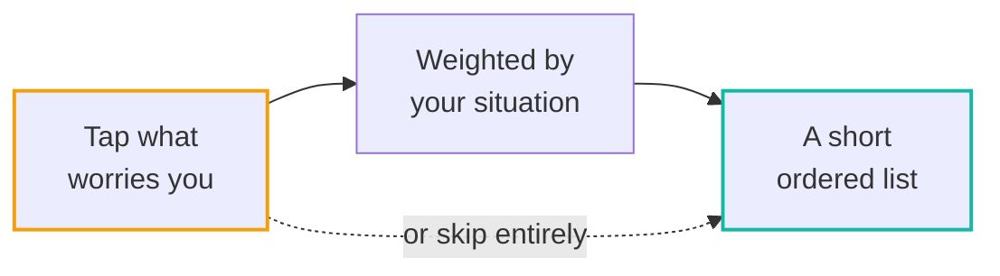
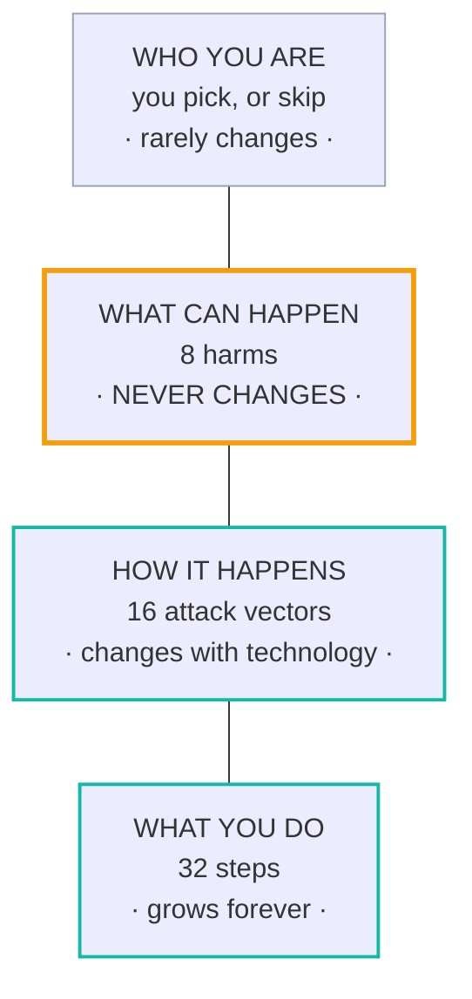
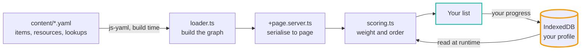

# Spectra

### Most security advice is a hundred-item wall. This asks what you're worried about, then hands you a short list.

[](https://github.com/KashishOO7/spectra/actions/workflows/ci.yml)
[](LICENSE)
[](LICENSE)
[]()
[]()
[]()

A journalist, a parent and a domestic-abuse survivor get different priorities out of the same
corpus, because the weighting follows the situation the reader describes.

Everything runs in the browser. Your state lives in IndexedDB on your own device and never leaves it.

**Live at [spectra.fpszero.com](https://spectra.fpszero.com/)** &nbsp;·&nbsp; by [FPS Zero](https://fpszero.com)

---

## The whole product in one picture



No signup screen. Tapping the harms **is** the questionnaire, and everything works for someone who
taps nothing at all.

---

## The model: four layers

Only the bottom two ever move. That is the whole design. New technology arrives as a new *method*
plus some new steps, slotted under a harm that already exists, so nothing at the top gets rewritten.



The two outlined in teal are where all the movement is. The amber layer is fixed, and the one above
it barely moves.

### The eight harms

Plain sentences, and they are the front page.

|  |  |
|---|---|
| Someone gets into your accounts | Someone reads what you say |
| Someone takes your money | Someone uses your device against you |
| Someone talks you into it | Someone pretends to be you |
| Someone follows where you go | Someone already has your details |

Harm membership is **derived**, from the `assets_protected` and `attack_vectors` every item already
carries. There is no harm field in the YAML and no manual tagging to keep in step. An item belongs
to every harm whose assets or vectors it covers, so items land in about three of them on purpose:
several doors into the same content.

> A blocking validator rule fails the build if any item resolves to no harm at all.

---

## Three numbers, three jobs

One number used to answer two questions, which is where every scoring defect came from. It is split
into three, and they never mix again.

| | What it answers | Who sees it |
|---|---|---|
| **Priority** | What should I offer next? | Nobody. Internal, never rendered as a number, badge or rank |
| **Coverage** | How am I doing? | The reader. `N of 8 covered`, the only number on screen |
| **Freshness** | What changed? | The reader, as a count and a list. Never a deduction |

```
priority = base_weight                    (0 to 10, expert judgement, CODEOWNERS-protected)
         × threat_multiplier              (max across your actors, never compounded)
         × (1 − compensating_factor)      (a stronger control you already have)
```

Coverage is `earned weight ÷ total applicable weight`. **Skipped steps stay in the denominator,
because declining is not progress.**

Two things that used to be in the formula are gone from the engine, not merely hidden: a curated
events feed, which double-counted facts already priced into `base_weight`, and a staleness discount,
which made a finished score fall on a date for a reason nobody could act on.

Full contract in [SCORING.md](SCORING.md), and on the on-site
[methodology page](https://spectra.fpszero.com/methodology).

> **Spectra is a prioritisation engine, not a calibrated risk calculator.** The weights are
> principled expert judgement anchored to public data (DBIR, IC3, HIBP), and SCORING.md says so
> plainly rather than implying more.

---

## What you get

| | |
|---|---|
| **Your list** | The ordered steps, each with a plain one-sentence description, per-platform instructions, and a primary source |
| **Your map** | A graph of the harms you tapped, the actors they imply, and the steps that help. Clicking an actor states which of your own taps put it there |
| **Something happened** | An incident path for the reader already in trouble, with the order-of-operations that matters when a device may be watched |
| **Guides, not a catalogue** | `/resources` points at maintained directories. Spectra names no app to go and get, and rates nobody |
| **Timeline** | Completed steps, milestones and life events, recorded in your browser so you can see change over time |

There is also a seven-question social-engineering quiz across the Cialdini registers, which
reweights the `human_vulnerability` steps between 0.8 and 1.4. The susceptibility score stays internal.

---

## How it's built



The amber node is the only thing that persists, and it never leaves the browser.

SvelteKit 2, Svelte 4, TypeScript and Tailwind, built with `adapter-static` to GitHub Pages as a
PWA. Content is YAML, compiled to a graph at build time and baked into the static output.
**There is no backend.**

---

## Getting started

Requires Node.js 20+ and npm 10+.

```bash
git clone https://github.com/KashishOO7/spectra.git
cd spectra
npm install
npm run dev
```

| Command | What it does |
|---|---|
| `npm run dev` | Local dev server |
| `npm run validate` | Content, taxonomy and no-internals-on-screen gates. **Blocking, runs in CI** |
| `npm run check` | `svelte-check` over `src/` |
| `npm run build` | Static production build |
| `npm run maintain` | Content-health report |
| `npm run new:item` | Scaffold a new checklist item |
| `npm run check:links` | Resolve every source URL |

The last three are run locally rather than on a cron.

---

## Project layout

```
spectra/
├── content/                # CC BY-SA 4.0
│   ├── items/              # the 32 checklist steps, one YAML each
│   ├── lookups/            # vocabulary many steps share, authored once, printed in each
│   ├── resources/          # the guides our steps point at
│   ├── controls/           # abstract mechanisms (MFA, FDE), validated, not graph-loaded
│   └── threats/            # threat nodes, validated, not graph-loaded
├── scripts/                # validate, check-internals, maintain, new:item, check:links
├── src/
│   ├── lib/
│   │   ├── audit/          # static data and pure helpers (harms, quiz, playbooks, life events)
│   │   ├── components/     # presentational views
│   │   ├── content/        # YAML parser and graph builder
│   │   ├── engine/         # scoring, coverage and the IndexedDB store
│   │   └── types.ts        # canonical TypeScript types and taxonomy
│   ├── routes/             # audit, checklist/[id], graph, resources, timeline, incident,
│   │                       # how-it-works, methodology, about
│   └── styles/             # app.css: the tokens both colour themes resolve to
├── .github/workflows/      # ci.yml deploys; the content automation is dormant by design
├── static/                 # PWA manifest, favicon, robots, sitemap, CNAME
└── SCORING.md  CONTRIBUTING.md  LICENSE
```

---

## The corpus today

| | |
|---|---|
| **Steps** | 32, all active |
| **By track** | 25 general · 9 women's safety · 8 journalist · 5 kids & teens · 2 corporate · 2 AI-focused *(overlapping)* |
| **Also** | 8 guides · 3 lookups · 4 threat nodes · 2 controls |
| **Taxonomy** | 10 categories · 10 actor types · 16 attack vectors · 13 assets · 6 tracks · 11 platforms · 10 emotional registers |

All canonical in `src/lib/types.ts`. The 8 harms are a projection over two of those, not a taxonomy
of their own.

**What 1.0 claims:** the essentials, done properly, for people who were never taught this. Not
comprehensive. Nothing in the corpus sits above maturity level 2, which is the right tier for the
default reader, and the UI does not imply depth that is not there.

---

## Contributing

See [CONTRIBUTING.md](CONTRIBUTING.md). Every `/content` change must pass `npm run validate`, and a
factual claim needs a primary source in the YAML.

`score_weight`, the threat multipliers, and the women's-safety and children's tracks are protected,
so changes there need maintainer review (see `CODEOWNERS`).

## License

Code (`/src`, `/scripts`): **AGPL-3.0** &nbsp;·&nbsp; Content (`/content`): **CC BY-SA 4.0**
