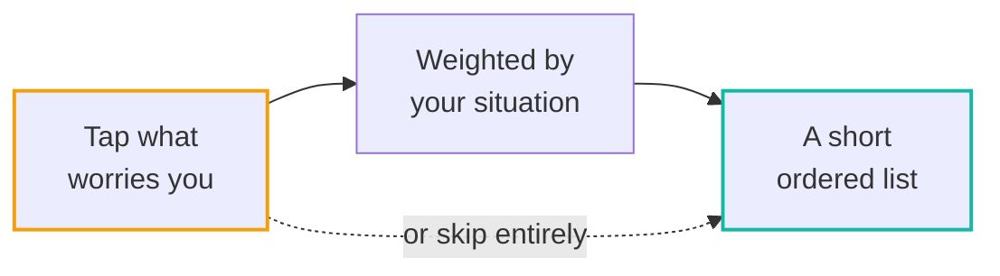
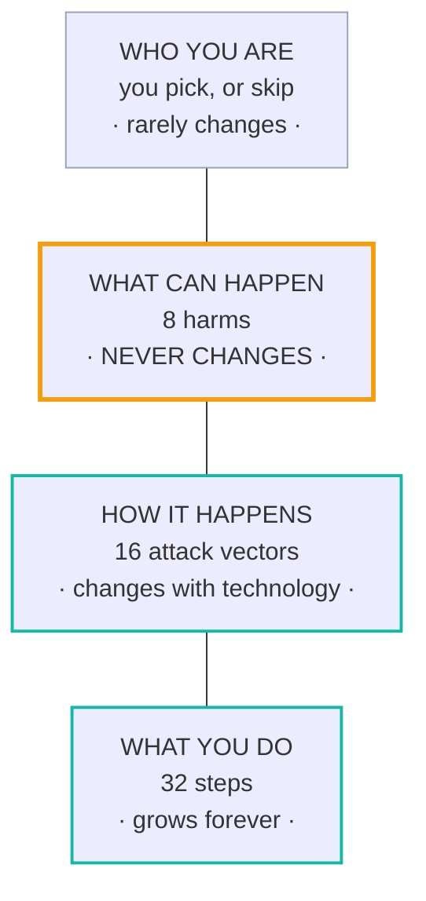
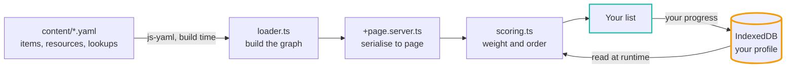

# Spectra

### Most security advice is a hundred-item wall. This asks what you're worried about, then hands you a short list.

[](https://github.com/KashishOO7/spectra/actions/workflows/ci.yml)
[](LICENSE)
[](LICENSE-CONTENT)
[]()
[]()
[]()

A journalist, a parent and a domestic-abuse survivor get different priorities out of the same
corpus, because the weighting follows the situation the reader describes. That is a measurable
claim, so here is the measurement. Top ten steps for a profile, against the top ten for someone
who said nothing:

```
baseline (said nothing)   #1  auth-2fa-001         shares 10/10
survivor                  #1  device-encrypt-001   shares  5/10
journalist                #1  device-encrypt-001   shares  4/10
parent                    #1  human-verify-001     shares  5/10
scam-wary                 #1  auth-2fa-001         shares  7/10
```

**Half the list changes, and three different steps can be number one.** Reproduce it from
`scoreAssessment` in `src/lib/engine/scoring.ts`; nothing here is hand-ordered.

Everything runs in the browser. Your state lives in IndexedDB on your own device and never leaves
it, and the page ships `connect-src 'self'`, so the browser itself forbids the app from contacting
anything. The privacy claim is one auditable line, enforced by something that is not us.

**Live at [spectra.fpszero.com](https://spectra.fpszero.com/)** &nbsp;·&nbsp;
**[Take the tour](https://spectra.fpszero.com/tour)**, twelve screens with every control boxed
&nbsp;·&nbsp; by [FPS Zero](https://fpszero.com)

---

## The whole product in one picture



No signup screen. Tapping the harms **is** the questionnaire, and everything works for someone who
taps nothing at all.

---

## The model: four layers

Only the bottom two ever move. That is the whole design. New technology arrives as a new *method*
plus some new steps, slotted under a harm that already exists, so nothing at the top gets rewritten.



The two outlined in teal are where all the movement is. The amber layer is fixed, and the one above
it barely moves.

### The eight harms

Plain sentences, and they are the front page.

|  |  |
|---|---|
| Someone gets into your accounts | Someone reads what you say |
| Someone takes your money | Someone uses your device against you |
| Someone talks you into it | Someone pretends to be you |
| Someone follows where you go | Someone already has your details |

Harm membership is **derived**, from the `assets_protected` and `attack_vectors` every item already
carries. There is no harm field in the YAML and no manual tagging to keep in step. An item belongs
to every harm whose assets or vectors it covers, so items land in about three of them on purpose:
several doors into the same content.

> A blocking validator rule fails the build if any item resolves to no harm at all.

---

## Three numbers, three jobs

One number used to answer two questions, which is where every scoring defect came from. It is split
into three, and they never mix again.

| | What it answers | Who sees it |
|---|---|---|
| **Priority** | What should I offer next? | Nobody. Internal, never rendered as a number, badge or rank |
| **Coverage** | How am I doing? | The reader. `N of 8 covered`, the only number on screen |
| **Freshness** | What changed? | The reader, as a count and a list. Never a deduction |

```
priority = base_weight                    (0 to 10, expert judgement, CODEOWNERS-protected)
         × threat_multiplier              (max across your actors, never compounded)
         × (1 − compensating_factor)      (a stronger control you already have)
```

Coverage is `earned weight ÷ total applicable weight`. **Skipped steps stay in the denominator,
because declining is not progress.**

Two things that used to be in the formula are gone from the engine, not merely hidden: a curated
events feed, which double-counted facts already priced into `base_weight`, and a staleness discount,
which made a finished score fall on a date for a reason nobody could act on.

Full contract in [SCORING.md](SCORING.md), and on the on-site
[methodology page](https://spectra.fpszero.com/methodology).

> **Spectra is a prioritisation engine, not a calibrated risk calculator.** The weights are
> principled expert judgement anchored to public data (DBIR, IC3, HIBP), and SCORING.md says so
> plainly rather than implying more.

---

## What you get

| | |
|---|---|
| **Your list** | One step at a time, not thirty-two. Each carries a sentence written for someone who was never taught this, a how-to written as steps, and a primary source. You never see the engine's numbers, and a lint gate makes that permanent rather than a habit. |
| **Say it in your own words** | Type *"my ex knows where I am"* and get the two steps that cover it. Below its threshold it says **Spectra does not cover that, and stops**, instead of handing you the closest thing on the shelf. No model, no download, nothing generated. |
| **Your map** | The harms you tapped, who they imply, and the steps standing in the way, drawn as a graph. Click an actor and it names which of your own taps put it there, so nothing on screen is unexplained. |
| **Something happened** | Five incident paths for the reader already in trouble, in the order that matters when the device in your hand may be the compromised one. Reachable from every page, because that reader cannot start with a checklist. |
| **Move it to another device** | Your entire setup in twenty characters. Send it as a link, scan it as a QR, or read it down a phone. It rides in the URL fragment, which browsers never transmit, so we never receive it. Always exactly twenty, so the length of a code cannot leak how far through the list you are. |
| **Print** | `/playbook` turns the list into paper with tick boxes, via the browser's own Save as PDF. Choose still to do, already done (which prints ticked, as a record), or set aside. No PDF library, so nobody downloads 300KB for it. |
| **Guides, not a catalogue** | Spectra names no app to go and get, and rates nobody, because a recommendation that suits us is worth nothing to you. It teaches what to look for and links a directory someone else maintains. |
| **Timeline** | What you finished and when, kept in your browser, so change is visible over months rather than felt. |
| **The tour** | Twelve screens of the running product with every control boxed and explained, for the visitor deciding whether to start. Not a mock-up: each screenshot is captured from the app and each highlight is the control's real measured rectangle, so a box cannot drift away from the button it points at. |

There is also a seven-question social-engineering quiz across the Cialdini registers, which
reweights the `human_vulnerability` steps between 0.8 and 1.4. The susceptibility score stays internal.

### Why the plain-sentence search cannot lie to you

It downloads nothing and generates nothing. It ranks sentences that already exist, so its entire
output space is steps a person wrote, a source backs and twenty-two validators passed. **A fabricated
recommendation is impossible by construction rather than unlikely by supervision**, and an engine
test asserts every id it returns resolves to something real.

The refusal is the part worth stealing. For a reader in danger, a confident wrong answer is worse
than no answer, so the threshold was measured rather than chosen: swept against 24 covered
questions and 23 out-of-scope ones, eight of the latter built deliberately from vocabulary the
corpus does carry, like *"my printer will not connect to wifi"*. The threshold is a named constant
in `src/lib/engine/router.ts`, so you can read the number rather than take it on trust.

---

## How it's built



The amber node is the only thing that persists, and it never leaves the browser.

SvelteKit 2, Svelte 4, TypeScript and Tailwind, built with `adapter-static` to GitHub Pages as a
PWA. Content is YAML, compiled to a graph at build time and baked into the static output.
**There is no backend.**

### What stops it rotting

Most of the failure modes here are editorial, not technical, so most of the gates are too.

| Gate | What it refuses to let through |
|---|---|
| **Twenty-two blocking validators, on the content** | An item that resolves to no harm. A claim about what a company does with your data. Jargon on a reader's screen. A country-specific helpline. A tracking parameter in a source URL. A step with no primary source. Prose gates, run in CI, not just a linter over code. |
| **`check-internals.ts`, invariant I5** | Any engine internal reaching a user screen. No multiplier, no raw score, no `+9pts`, no internal date, on any of 22 components. The one page allowed to show them is named in the script. |
| **CI, on every push and pull request** | Both gates above run, plus `npm run check` and a full build, before anything deploys. A broken item cannot reach the site by being merged on a busy day. |

**Nothing names a tool you have to go and get.** That is not a style preference, it is
`NO_COMPANY_CONDUCT` and `LOOKUP_NAMES_NO_ONE`, and two tests. A favourable claim is the worst
kind: a wrong warning costs a reader a minute, a wrong reassurance stops them checking at all.

---

## Getting started

Requires Node.js 20+ and npm 10+.

```bash
git clone https://github.com/KashishOO7/spectra.git
cd spectra
npm install
npm run dev
```

| Command | What it does |
|---|---|
| `npm run dev` | Local dev server |
| `npm run validate` | Content, taxonomy and no-internals-on-screen gates. **Blocking, runs in CI** |
| `npm run check` | `svelte-check` over `src/` |
| `npm run build` | Static production build |
| `npm run maintain` | Content-health report |
| `npm run new:item` | Scaffold a new checklist item |
| `npm run check:links` | Resolve every source URL |

The last three are run locally rather than on a cron.

---

## Project layout

```
spectra/
├── content/                # CC BY-SA 4.0
│   ├── items/              # the 32 checklist steps, one YAML each
│   ├── lookups/            # vocabulary many steps share, authored once, printed in each
│   ├── resources/          # the guides our steps point at
│   ├── controls/           # abstract mechanisms (MFA, FDE), validated, not graph-loaded
│   └── threats/            # threat nodes, validated, not graph-loaded
├── scripts/                # validate, check-internals, maintain, new:item, check:links,
│                           # capture-tour (regenerates the tour's screenshots and boxes)
├── src/
│   ├── lib/
│   │   ├── audit/          # static data and pure helpers (harms, quiz, playbooks, life events)
│   │   ├── components/     # presentational views
│   │   ├── content/        # YAML parser and graph builder
│   │   ├── engine/         # scoring, coverage, the IndexedDB store, the profile codec
│   │   │                   # (fingerprint.ts, qr.ts) and the plain-sentence router
│   │   │                   # (router.ts, vocabulary.ts)
│   │   └── types.ts        # canonical TypeScript types and taxonomy
│   ├── routes/             # audit, checklist/[id], graph, resources, timeline, incident,
│   │                       # playbook, tour, how-it-works, methodology, about
│   └── styles/             # app.css: the tokens both colour themes resolve to
├── .github/workflows/      # ci.yml deploys; the content automation is dormant by design
├── static/                 # PWA manifest, favicon, robots, sitemap, CNAME, tour screenshots
└── SCORING.md  LICENSE  LICENSE-CONTENT
```

---

## The corpus today

| | |
|---|---|
| **Steps** | 32, all active |
| **By track** | 25 general · 9 women's safety · 8 journalist · 5 kids & teens · 2 corporate · 2 AI-focused *(overlapping)* |
| **Also** | 8 guides · 3 lookups · 4 threat nodes · 2 controls |
| **Taxonomy** | 10 categories · 10 actor types · 16 attack vectors · 13 assets · 6 tracks · 11 platforms · 10 emotional registers |

All canonical in `src/lib/types.ts`. The 8 harms are a projection over two of those, not a taxonomy
of their own.

**What 1.0 claims:** the essentials, done properly, for people who were never taught this. Not
comprehensive. Nothing in the corpus sits above maturity level 2, which is the right tier for the
default reader, and the UI does not imply depth that is not there.

---

## Contributions

**Spectra is not accepting contributions yet.** It is still being built, and the content is being
rewritten, so a pull request today would be reviewed against a moving target. Please do not open
one; it will not be merged.

This will change. The gates that decide what good looks like are already in the repo and runnable:
`npm run validate` refuses an item that resolves to no harm, a factual claim with no primary
source, jargon on a reader's screen, or a source URL carrying a tracking parameter. When
contributions open, those are the bar.

## License

Code (`/src`, `/scripts`): [**AGPL-3.0-only**](LICENSE) &nbsp;·&nbsp;
Content (`/content`): [**CC BY-SA 4.0**](LICENSE-CONTENT)

Copyright (C) 2026 Kashish (fpszero). Two licences, two files, and the split is by directory: the
prose that ships inside `src/` is covered by the code licence.
